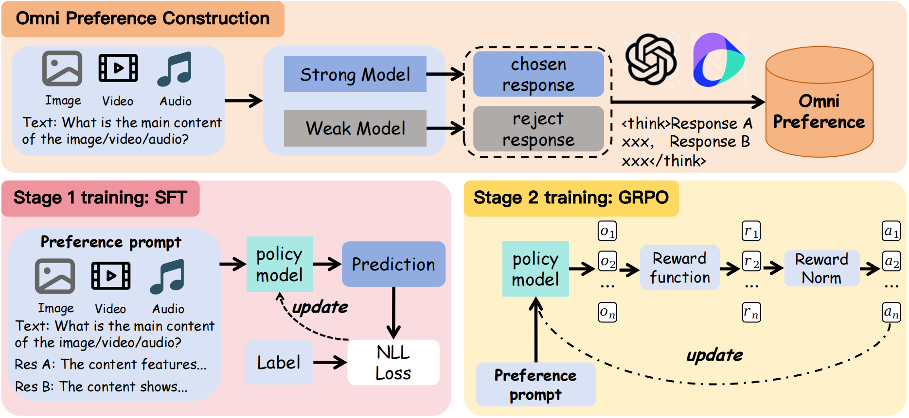

# Omni-RRM: Advancing Omni Reward Modeling via Automatic Rubric-Grounded Preference Synthesis

[**🤗 Omni-Preference**](https://huggingface.co/datasets/Omni-RRM/Omni-Preference) ·
[**🤗 Omni-RRM-7B**](https://huggingface.co/Omni-RRM/Omni-RRM-7B) ·
[**🤗 Omni-RRM-3B**](https://huggingface.co/Omni-RRM/Omni-RRM-3B) ·
[**📄 Paper**](https://arxiv.org/abs/2602.00846) ·
[**🌐 Project Page**](https://tmfk418.github.io/Omni-RRM/)

Official repository for **Omni-RRM**, a rubric-grounded omni-modal reward model for preference evaluation across **text, image, video, and audio**.

## 📖 Overview

Multimodal large language models (MLLMs) have become increasingly capable across image, video, and audio inputs, but their alignment still relies heavily on reward models that are often vision-centric, scalar-only, or expensive to supervise with human labels.

**Omni-RRM** addresses this gap by formulating omni-modal reward modeling as **rubric-grounded structured generation**. Instead of predicting only a scalar reward or a binary preference, Omni-RRM generates:

- overall scores for both responses,
- a categorical preference verdict,
- five criterion-level comparative rationales,
- and a redundant verdict copy for robust parsing.

This makes reward judgments more auditable and ties the rubric directly to both supervised fine-tuning and reinforcement learning.

Our main contributions are:

1. **Omni-Preference**, a 41K rubric-grounded preference dataset spanning image, video, and audio contexts.
2. **Automatic rubric-grounded preference synthesis**, where strong/weak model outputs are annotated and reconciled by heterogeneous teacher models.
3. **Structured reward modeling**, using five shared criteria: fluency/coherence, relevance, accuracy/completeness, reasoning quality, and safety/ethical alignment.
4. **SFT + GRPO training**, where rubric-grounded rationales, schema validity, preference correctness, and verdict consistency are jointly optimized.
5. **Omni-modal evaluation**, covering image, video, audio, text transfer, and Best-of-N inference-time response selection.

## 🛠️ Methodology

The overall pipeline contains two stages: **Omni-Preference construction** and **two-stage Omni-RRM training**.

<div align="center">

</div>

### 1. Omni-Preference Construction

We construct **Omni-Preference**, a high-quality rubric-grounded preference dataset with approximately **41K** retained samples.

| Modality | Data Source | Samples |
|---|---:|---:|
| Image | RLAIF-V | 17.0K |
| Video | ActivityNet, Charades, Ego4D, NextQA, YouCook2 | 12.2K |
| Audio | Clotho-AQA | 11.8K |
| **Total** | — | **41.0K** |

The construction pipeline has two main stages.

#### Stage 1: Candidate Pair Generation

For each multimodal input, we generate candidate response pairs by contrasting a stronger model and a weaker model. This creates diverse preference candidates across image, video, and audio contexts.

#### Stage 2: Rubric-Grounded Teacher Reconciliation

Each candidate pair is annotated by heterogeneous teacher models with:

- scalar scores,
- categorical preference verdicts,
- and five-criterion rubric-grounded comparative rationales.

A pair is retained only when both teachers reach an identical non-tie verdict that is consistent with the score ranking and rubric-grounded evidence. This strict consensus filtering reduces teacher-specific artifacts and improves supervision quality.

Although the training preferences are automatically synthesized, we further validate the data reliability through human annotation and train-test contamination checks. In our validation, reconciled labels achieve **83% human-majority agreement**, **Fleiss' κ = 0.81**, and **79% rationale acceptance**, with no overlapping samples found against the evaluation splits.

### 2. Structured Output Schema

Omni-RRM generates a rubric-grounded record rather than a scalar score only. A simplified schema is shown below:

```json
{
  "score_A": 8,
  "score_B": 6,
  "verdict": "A",
  "criteria": {
    "fluency_coherence": "...",
    "relevance": "...",
    "accuracy_completeness": "...",
    "reasoning_quality": "...",
    "safety_ethics": "..."
  },
  "final_verdict": "A"
}
```

The same schema is used in both SFT targets and GRPO reward computation, tying the rubric to optimization rather than only inference-time prompting.

### 3. Two-Stage Training

We train Omni-RRM with a progressive SFT + GRPO strategy.

#### Stage 1: Supervised Fine-Tuning

The model first learns the structured reward generation format through supervised fine-tuning. SFT teaches the model to generate scores, criterion-level rationales, and preference verdicts in a stable schema.

#### Stage 2: GRPO Reinforcement Learning

We then refine the model using **Group Relative Policy Optimization (GRPO)**. The reward function contains three components:

- `R_fmt`: rewards valid output schema and parseability;
- `R_pref`: rewards preference and score correctness;
- `R_rub`: rewards rubric-grounded rationale quality and verdict-rationale consistency.

This stage improves discrimination on low-margin preference pairs and further calibrates the reward boundary.

## 🚀 Main Results

We evaluate Omni-RRM on five main preference benchmarks:

- **VL-RewardBench**
- **MM-RewardBench**
- **ShareGPT-Video**
- **Audio-HH-RLHF**
- **Omni-RewardBench-TA2T**

The **Overall** score is the mean accuracy over the five benchmark columns. TA2T is reported with tie cases included in the main table; full with-/without-tie results are provided in the supplementary material.

| Model | VL-Reward | MM-RewardBench | ShareGPT-Video | Audio-HH | TA2T | Overall |
|---|---:|---:|---:|---:|---:|---:|
| GPT-4o-mini | 59.8 | 61.9 | 53.9 | 58.2 | 57.9 | 58.3 |
| Gemini-2.0-Flash | 73.4 | 62.8 | 74.6 | 60.1 | 59.9 | 66.2 |
| Gemini-2.5-Pro | **79.6** | 63.3 | 78.8 | 66.5 | 64.9 | **70.6** |
| Qwen2.5-Omni-3B | 53.7 | 53.9 | 58.1 | 58.7 | 47.9 | 54.5 |
| Qwen2.5-Omni-7B | 57.8 | 57.5 | 66.3 | 62.4 | 56.9 | 60.2 |
| Omni-RewardModel-BT | 60.4 | 58.4 | 63.7 | 61.3 | 60.5 | 60.9 |
| Omni-RRM-3B-SFT | 56.8 | 58.1 | 64.9 | 60.3 | 54.3 | 58.9 |
| Omni-RRM-7B-SFT | 60.4 | 61.0 | 70.5 | 62.8 | 58.5 | 62.6 |
| Omni-RRM-3B-SFT+RL | 58.5 | 68.9 | 67.4 | 65.1 | 61.1 | 64.2 |
| Omni-RRM-7B-SFT+RL | 67.1 | **72.9** | **80.2** | **66.8** | **65.0** | 70.4 |

### Highlights

- **Strong open-source omni-modal reward modeling**: Omni-RRM-7B-SFT+RL reaches **70.4% five-benchmark Overall accuracy**, closely matching Gemini-2.5-Pro at 70.6%.
- **Video and audio performance**: Omni-RRM-7B achieves **80.2%** on ShareGPT-Video, **66.8%** on Audio-HH, and **65.0%** on TA2T.
- **Rubric-grounded rationales matter**: Removing rubric rationales or rubric-aware RL substantially degrades performance in ablation studies.
- **Inference-time alignment**: Omni-RRM improves Best-of-N response selection without modifying the base generator.
- **External audio validation**: TA2T results are highly correlated with Audio-HH across common models, supporting Audio-HH as a meaningful controlled audio proxy.

## 🔧 Get Started

### Environment Setup

We recommend the following setup:

- Python >= 3.10
- CUDA >= 11.8
- Linux with multi-GPU support

```bash
conda create -n omnirrm python=3.10 -y
conda activate omnirrm

git clone https://github.com/dma2077/Omni-RRM.git
cd Omni-RRM

pip install -r requirements.txt
```

Install the Swift framework:

```bash
git clone https://github.com/modelscope/ms-swift.git
cd ms-swift
pip install -e .
cd ..
```

> Note: The current environment has been tested with PyTorch 2.6 and CUDA 11.8. If you use CUDA 12.x, please install the matching PyTorch build manually.

## 📦 Model Checkpoints

We release both 3B and 7B Omni-RRM checkpoints.

### Hugging Face

- [Omni-RRM-3B](https://huggingface.co/Omni-RRM/Omni-RRM-3B)
- [Omni-RRM-7B](https://huggingface.co/Omni-RRM/Omni-RRM-7B)

### Example Download

```python
from huggingface_hub import snapshot_download

model_dir = snapshot_download(
    repo_id="Omni-RRM/Omni-RRM-7B",
    local_dir="./Omni-RRM-7B"
)
```

We use Qwen2.5-Omni-3B and Qwen2.5-Omni-7B as base backbones.

## 📂 Dataset Preparation

Omni-RRM uses the **Omni-Preference** dataset hosted on Hugging Face:

```bash
git lfs install
git clone https://huggingface.co/datasets/Omni-RRM/Omni-Preference
cd Omni-Preference
```

The dataset contains:

```text
Omni-Preference/
├── audio_files/
├── rlaif-v-dataset/
├── video-dataset/
└── dataset_jsonl/
```

The main data components are:

- **Image**: `rlaif-v-dataset`
- **Video**: `video-dataset`
- **Audio**: `audio_files`
- **Training JSONL files**: `dataset_jsonl`

## ⚙️ Data Preprocessing

Update the local file paths in JSONL files to match your dataset location.

```bash
python train/change_path/audio/change_sft_path.py
python train/change_path/audio/change_rl_path.py
python train/change_path/image/change_sft_path.py
python train/change_path/image/change_rl_path.py
python train/change_path/video/change_sft_path.py
python train/change_path/video/change_rl_path.py
```

Please double-check the rewritten paths before training.

## 🚀 Training

### 1. Supervised Fine-Tuning

Example for the 7B model:

```bash
bash train/sft_7b_lora.sh
```

### 2. GRPO Reinforcement Learning

```bash
bash train/grpo_7b.sh
```

Both stages use LoRA fine-tuning. In our experiments, LoRA rank is set to 8 with alpha 32, and LoRA is applied to all linear layers in the language model and multimodal adapter layers while freezing the vision encoder.

## 🔍 Inference and Evaluation

### Image Benchmarks

#### VL-RewardBench

```bash
python inference/VL_Reward_final/infer_lora_vl.py
python inference/VL_Reward_final/eval.py
```

#### MM-RewardBench

```bash
python inference/MultimodalRewardBench_final/infer_lora_multimodal.py
python inference/MultimodalRewardBench_final/eval.py
```

### Video Benchmarks

#### ShareGPT-Video DPO

```bash
python inference/ShareGPT-Video-DPO-final/infer_lora.py
python inference/ShareGPT-Video-DPO-final/eval.py
```

#### Video-MME Best-of-N

```bash
python inference/videomme_final/qwen2.5omni.py
python inference/videomme_final/eval.py
python inference/videomme_final/bon.py
python inference/videomme_final/eval_bon.py
```

### Audio Benchmarks

#### Audio-HH-RLHF

```bash
python inference/Audio-HH-RLHF_final/text_to_audio.py
python inference/Audio-HH-RLHF_final/infer_lora.py
python inference/Audio-HH-RLHF_final/eval.py
```

#### AVQA-R1-6K Best-of-N

```bash
python inference/AVQA-R1-6K_final/qwen2.5omni.py
python inference/AVQA-R1-6K_final/eval.py
python inference/AVQA-R1-6K_final/bon.py
python inference/AVQA-R1-6K_final/eval_bon.py
```

### Text Benchmark

#### HH-RLHF

```bash
python inference/HH-RLHF_final/infer_lora.py
python inference/HH-RLHF_final/eval.py
```

## 💻 Compute Budget

The following approximate resource estimates are provided for reproducibility.

| Component | Estimated Cost |
|---|---:|
| Retained Omni-Preference samples | 41K |
| Raw context-pair instances before filtering | ~51K |
| Generated candidate responses | ~102K |
| Candidate generation | ~120 RTX3090 GPU-hours |
| Dual-teacher annotation | ~102K API calls |
| Teacher annotation tokens | ~204M input / ~51M output tokens |
| 3B SFT / GRPO training | 3h / 12h on 8 A100 GPUs |
| 7B SFT / GRPO training | 5h / 18h on 8 A100 GPUs |
| Evaluation | 48h on 8 RTX3090 GPUs |

## 📁 Recommended Repository Structure

```text
Omni-RRM/
├── imgs/
│   └── omni-rrm.png
├── train/
│   ├── sft_7b_lora.sh
│   ├── grpo_7b.sh
│   └── change_path/
├── inference/
│   ├── VL_Reward_final/
│   ├── MultimodalRewardBench_final/
│   ├── ShareGPT-Video-DPO-final/
│   ├── Audio-HH-RLHF_final/
│   ├── videomme_final/
│   ├── AVQA-R1-6K_final/
│   └── HH-RLHF_final/
├── requirements.txt
└── readme.md
```

## 📄 License

License information will be updated before the official release. Dataset usage follows the licenses of the original source datasets.

